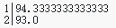

# **Course10：The HAVING statement - HAVING语句**
HAVING子句是group by查询的重要部分，它与WHERE子句几乎相同，但是在聚合阶段之后处理聚合字段，而WHERE子句在聚合过程之前过滤数据集。

举个例子，GROUP BY中的WHERE语句将只对匹配条件的字段进行分组：
```
CREATE TABLE grades (name TEXT, class INTEGER, grade INTEGER);

INSERT INTO grades (name, class, grade) VALUES
    ("John", 1, 97), ("Eric", 1, 88), ("Jessica", 1, 98), ("Mike", 1, 82), ("Jeff", 1, NULL),
    ("Ben", 2, 93), ("Andrew", 2, 82), ("Jason", 2, 87), ("Carol", 2, 99), ("Fred", 2, 79);

SELECT class, AVG(grade)
FROM grades
WHERE grade > 85
GROUP BY class;
```

语句执行结果：



HAVING语句将使用聚合的结果过滤生成的分组数据集：
```
CREATE TABLE grades (name TEXT, class INTEGER, grade INTEGER);

INSERT INTO grades (name, class, grade) VALUES
    ("John", 1, 97), ("Eric", 1, 88), ("Jessica", 1, 98), ("Mike", 1, 82), ("Jeff", 1, NULL),
    ("Ben", 2, 93), ("Andrew", 2, 82), ("Jason", 2, 87), ("Carol", 2, 99), ("Fred", 2, 79);

SELECT class, AVG(grade)
FROM grades
GROUP BY class
HAVING AVG(grade) > 90;
```

语句执行结果：


注意，在这个特定的查询中，WHERE-filtered查询并没有改变聚集的类的数量(因为filter在每个类中至少保留了一个student)，但是HAVING-filtered查询删除了一个没有通过平均分的类。

当然，您可以将WHERE和have结合起来，得到您想要的结果。


## Exercise - 练习
找出所有至少有3名学生的班级的最高分。

```
CREATE TABLE grades (name TEXT, class INTEGER, grade INTEGER);

INSERT INTO grades (name, class, grade) VALUES
    ("John", 1, 97), ("Eric", 1, 88),
    ("Ben", 2, 93), ("Andrew", 2, 82), ("Jason", 2, 87), ("Carol", 2, 99), ("Fred", 2, 79),
    ("Steve", 3, 91), ("Bill", 3, 84), ("Barney", 3, 97);

-- write your code here

```
