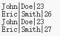

# **Course5：Updating rows - 更新行**
使用UPDATE语句更新行。更新分为两部分完成：定义应更新哪些行，以及要替换的列的值。

很多时候UPDATE语句的目标是替换一行，其中查询将使用表的主键来选择要更新的行。

以下是UPDATE语句：
```
UPDATE table_name
SET column1 = value1, column2 = value2, ...
WHERE key = value
```

我们来看一个UPDATE语句如何工作的例子。
```
CREATE TABLE customers (first_name NOT NULL, last_name NOT NULL, age);

INSERT INTO customers (first_name, last_name, age)
VALUES ("John", "Doe", 23), ("Eric", "Smith", 26);

SELECT * FROM customers;

UPDATE customers SET last_name = "Heart" WHERE first_name = "John";

SELECT * FROM customers;
```

语句执行结果：



## Exercise - 练习
添加更新语句，将两个SELECT语句之间的Eric年龄更新为27。

```
CREATE TABLE customers (first_name NOT NULL, last_name NOT NULL, age);

INSERT INTO customers (first_name, last_name, age)
VALUES ("John", "Doe", 23), ("Eric", "Smith", 26);

SELECT * FROM customers;

-- enter code here

SELECT * FROM customers;
```
